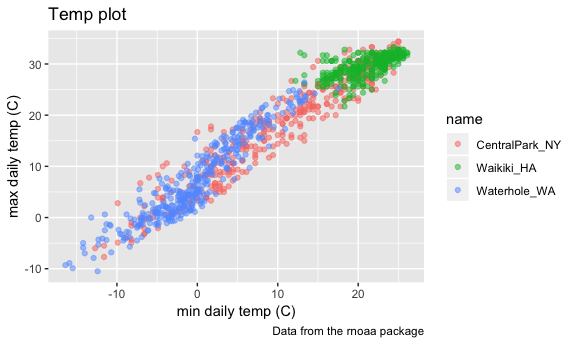
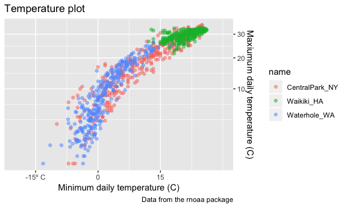

visualization\_2
================
Jiayi Shen
10/02/2018

``` r
weather_df = 
  rnoaa::meteo_pull_monitors(c("USW00094728", "USC00519397", "USS0023B17S"),
                      var = c("PRCP", "TMIN", "TMAX"), 
                      date_min = "2017-01-01",
                      date_max = "2017-12-31") %>%
  mutate(
    name = recode(id, USW00094728 = "CentralPark_NY", 
                      USC00519397 = "Waikiki_HA",
                      USS0023B17S = "Waterhole_WA"),
    tmin = tmin / 10,
    tmax = tmax / 10) %>%
  select(name, id, everything())
```

    ## file path:          /Users/s/Library/Caches/rnoaa/ghcnd/USW00094728.dly

    ## file last updated:  2018-09-26 23:31:54

    ## file min/max dates: 1869-01-01 / 2018-09-30

    ## file path:          /Users/s/Library/Caches/rnoaa/ghcnd/USC00519397.dly

    ## file last updated:  2018-09-26 23:32:07

    ## file min/max dates: 1965-01-01 / 2018-09-30

    ## file path:          /Users/s/Library/Caches/rnoaa/ghcnd/USS0023B17S.dly

    ## file last updated:  2018-09-26 23:32:12

    ## file min/max dates: 1999-09-01 / 2018-09-30

Start a plot
============

first scatterplot!!

``` r
ggplot(weather_df, aes(x = tmin, y = tmax)) + 
  geom_point(aes(color = name), alpha = .5) +
  labs(
    title = "Temp plot",
    x = "min daily temp (C)",
    y = "max daily temp (C)",
    caption = "Data from the rnoaa package"
  )
```

    ## Warning: Removed 15 rows containing missing values (geom_point).



``` r
# axes are going to be labeled as the variable name by default.
```

Tick marks and labels
=====================

``` r
ggplot(weather_df, aes(x = tmin, y = tmax)) + 
  geom_point(aes(color = name), alpha = .5) + 
  labs(
    title = "Temperature plot",
    x = "Minimum daily temperature (C)",
    y = "Maxiumum daily temperature (C)",
    caption = "Data from the rnoaa package"
       ) + 
  scale_x_continuous(breaks = c(-15, 0, 15), 
                     labels = c("-15º C", "0", "15"),
                     limits = c(-20, 30)) +
  scale_y_continuous(position = "right", 
                     trans = "sqrt")     #quotation marks 
```

    ## Warning in self$trans$transform(x): NaNs produced

    ## Warning: Transformation introduced infinite values in continuous y-axis

    ## Warning: Removed 90 rows containing missing values (geom_point).



Colors and themes
=================
